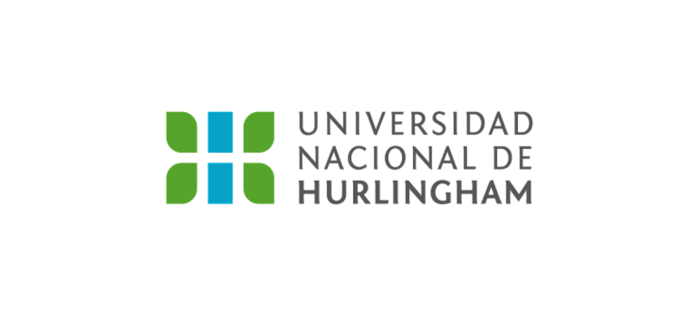

- Yo

Hola, me llamo Lautaro Milrad, 39 años. Estoy comenzando mi segundo año en la carrera. En 2019 charlando con una compañera de trabajo me recomendó la UNAHUR y decidí darme una nueva oportunidad tras haber hecho el CBC de la UBA en 2007 para Ingeniería en Sistemas.
  Actualmente y desde 2011 trabajo en la compañia de telecomunicaciones Claro Argentina y me desempeño como Asesor de atención personalizada ( yo no llamo a nadie para hinchar las guindas!), en el trabajo actual me encuentro super cómodo, trabajo en un buen ambiente, pero siento que no estoy dando todo lo que podria dar.
Desde chico me gusta la programacón y siempre me pregunto el por qué, para qué y cómo. Y creo que justamente eso me lleva a estar constantemente buscar nuevos conocimientos.

- Mis gustos

Siempre me gustaron los deportes de contacto, las artes marciales y el deporte en gral.
Fuí mucho de jugar Cs, Lineage 2, y otros shooters (muy vicio).
Tengo 2 gatos y tendría 100 si pudiese.
